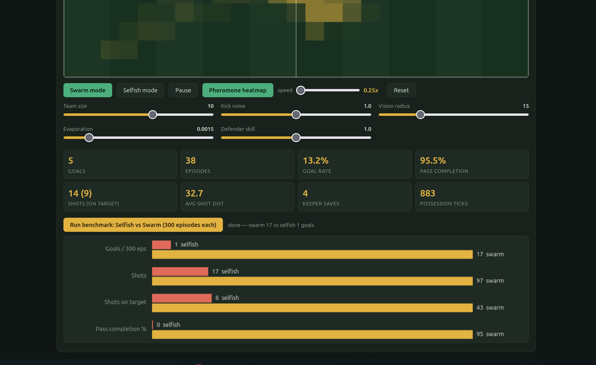

# AFC Richmond

**Swarm intelligence case study: ten ordinary players, coordinated by Boids + Ant Colony Optimization + Particle Swarm Optimization, outscore a more traditional, individually driven side 17× over the course of a regular Premier League-style season.**

> Lab 04 — Artificial Intelligence · Population-Based Approach / Swarm Intelligence
> Zero dependencies: one HTML file, one simulation module, one Node test suite.


*Live playback: gold attackers, red defenders, white ball with motion trail. The glowing overlay is the pheromone field — passing corridors the team has collectively learned.*

---

## 1. Problem Statement

Can a team of ordinary, individually limited players beat a stronger, well-organized opponent purely through **coordination structure**, with no improvement to any individual agent?

Every attacker on AFC Richmond is worse than every defender on every axis that matters:

| Attribute | AFC Richmond attacker | Defender |
|---|---|---|
| Speed | 0.5 u/tick | **0.68 u/tick** |
| Kick accuracy | error grows with distance: `σ = 0.011 · dist · noise` | — |
| Vision | myopic (radius 15) | full field |
| Organization | none built-in | goal-side man-marking + goalkeeper |

Each episode starts at midfield and ends in a goal, a turnover, or a timeout. The same bodies run under two controllers:

- **Selfish baseline** — every player chases the ball; the holder dribbles at goal and shoots when in range. Individual optimization.
- **Swarm controller** — identical bodies; three classic population-based mechanisms coordinate them instead.

## 2. Results

```
$ node test_sim.js
selfish: 1/300 goals, swarm: 17/300 goals
swarm pass completion: 95.3%
all tests pass
```

Aggregated over 3 seeds × 100 episodes: **swarm 17 goals, selfish 1** — a 17× improvement with identical players. Across a wider seed sweep the swarm averages ~9 ± 3 goals per 150 episodes; selfish stays at 0–1.

The simulation enforces realistic ball rules: a kicker can never receive his own pass in flight, and recovering a loose ball counts as a dribble, not a completed pass.



*Built-in benchmark (300 episodes per mode, same seeds as the test suite): goals 17 vs 1, shots 97 vs 17, shots on target 43 vs 8, pass completion 95% vs 0%.*

## 3. Quick Start

```bash
node test_sim.js        # assert-based verification, ~5 s, no frameworks
```

Then open `index.html` in any browser — no build step, no dependencies. The dashboard provides:

- live pitch with **pheromone heatmap** overlay (toggleable)
- **Swarm / Selfish** mode toggle on identical players
- playback speed slider, **0.25× – 4×**, with ball motion trail for readability
- parameter sliders: team size, kick noise, vision radius, evaporation rate, defender skill
- live metrics and a one-click **300-episode benchmark** with comparison chart

**Suggested experiment:** raise *kick noise*. The selfish baseline collapses immediately (long shots spray wide); the swarm barely degrades, because short passes tolerate noise. That is the thesis in one slider.

## 4. Method — Three Algorithms, One Controller

| Mechanism | Origin | Role in this system |
|---|---|---|
| **Boids** | Reynolds (1987) | Off-ball shape: separation from teammates and markers, cohesion toward a support ring held *ahead of* the ball, alignment drifting goalward. A caste split assigns odd-index players as deep **runners** and even-index players as the **support ring**. |
| **ACO stigmergy** | Dorigo (1992) | A 25×16 pheromone grid over the pitch. Completed passes deposit pheromone along their corridor (weighted by field progress); goals deposit heavily; everything evaporates each tick. The holder scores candidate lanes by `pheromone × openness × progress` and selects by **roulette wheel** (weight = score², β = 2). The team learns corridors the defense fails to cover — visible in the heatmap. |
| **PSO** | Kennedy & Eberhart (1995) | Each player's off-ball target is a particle. `pbest` = the best spot where that player ever received a pass (valued by proximity to goal); `gbest` = the team-wide best. Runners weight `pbest` (diversity), support weights `gbest` (consensus). |

## 5. Why the Collective Wins

1. **Aim error is proportional to distance.** Five 12-unit passes stay accurate where one 60-unit punt sprays wide; the relay beats the hero ball.
2. **The ball outruns everyone.** Passes travel at 1.7 u/tick, shots at 2.6, the fastest player at 0.68. Pass chains move the ball faster than any defense can reposition.
3. **Defenders re-mark every ~14 ticks.** Quick pass sequences dislocate the defense *between* its decision cycles.
4. **Ten spread attackers vs. five defenders.** Numerical superiority is created by positioning, not skill.
5. **One-touch finishing.** Inside shot range, a control touch only gives the keeper time to set — so there is none.

## 6. Engineering Notes

- Unnormalized PSO attraction collapses the team onto midfield `gbest`; it must be normalized to a directional hint.
- Argmax lane selection produces sterile sideways circulation. Roulette-wheel exploration finds the risky vertical passes that actually penetrate — exploration *is* the offense.
- "Pressed near goal → shoot" must be a hard rule, or pheromone loops circulate the ball forever.
- Spawning runners already upfield was the largest single structural gain (shots ×2).
- Raising shot speed (2.6 vs. 1.7) outperformed every smarter-aiming heuristic tried.
- Measured dead end: 143/153 keeper rebounds are lost to the faster defenders — rebound poaching helps less than expected.
- Deterministic seeded RNG (mulberry32) throughout: every run reproducible, every claim testable. The headline test aggregates 3 seeds × 100 episodes so a lucky seed cannot flip the verdict.

## 7. Repository Layout

```
Lab_04/
├── sim.js           # headless simulation core (no DOM) — shared by UI and tests
├── test_sim.js      # Node assert suite: physics premise, evaporation, determinism, headline claim
├── index.html       # single-file dashboard: canvas, heatmap, sliders, benchmark chart
├── playback.gif     # live playback capture (embedded above)
├── screenshot.png   # dashboard capture (embedded above)
├── references.docx  # reference list
└── README.md
```

## References

1. Reynolds, C. W. (1987). Flocks, herds and schools: A distributed behavioral model. *SIGGRAPH '87*, 25–34.
2. Dorigo, M. (1992). *Optimization, Learning and Natural Algorithms.* PhD thesis, Politecnico di Milano.
3. Kennedy, J., & Eberhart, R. (1995). Particle swarm optimization. *Proc. IEEE ICNN*, 1942–1948.
4. Kitano, H., Asada, M., Kuniyoshi, Y., Noda, I., & Osawa, E. (1997). RoboCup: The robot world cup initiative. *Proc. Agents '97*, 340–347.
